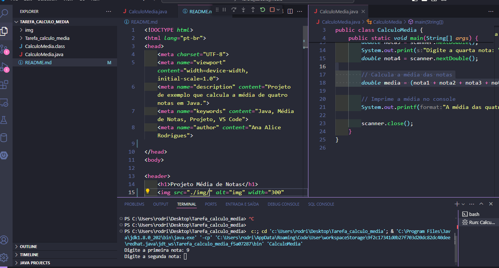

<!DOCTYPE html>
<html lang="pt-br">
<head>
    <meta charset="UTF-8">
    <meta name="viewport" content="width=device-width, initial-scale=1.0">
    <meta name="description" content="Projeto de exemplo que calcula a média de quatro notas em Java.">
    <meta name="keywords" content="Java, Média de Notas, Projeto, VS Code">
    <meta name="author" content="Ana Alice Rodrigues">

</head>
<body>

<header>
    <h1>Projeto Média de Notas</h1>
    
</header>

    
Índice

    <ol>
        <li><a href="#sobre-o-projeto">Sobre o projeto</a></li>
        <li><a href="#parte-tecnica">Parte Técnica</a></li>
        <li><a href="#estrutura-dos-arquivos">Estrutura dos Arquivos</a></li>
        <li><a href="#casos-de-uso">Casos de Uso</a></li>
        <li><a href="#ferramentas">Ferramentas</a></li>
        <li><a href="#contato">Contato</a></li>
    </ol>

<section id="sobre-o-projeto">
    <h2>Sobre o projeto</h2>
    

        Este projeto demonstra como calcular a média de quatro notas utilizando a linguagem Java. Ele inclui a entrada de dados pelo usuário, cálculo da média e exibição do resultado no console.
    

    

        Proposta de Valor: Oferecer um exemplo prático e educacional de como realizar operações básicas de entrada e saída de dados em Java.
    

</section>

<section id="parte-tecnica">
    <h2>Parte Técnica</h2>
    <ul>
        <li>IDE utilizada: Visual Studio Code</li>
        <li>Backend: O projeto é focado na lógica de cálculo em Java.</li>

    </ul>
</section>

<section id="estrutura-dos-arquivos">
    <h2>Estrutura dos Arquivos</h2>
    <ul>
        <li><strong>CalculoMedia.java</strong>: Arquivo principal que contém o código para entrada das notas, cálculo da média e exibição do resultado.</li>
    </ul>
</section>

<section id="casos-de-uso">
    <h2>Casos de Uso</h2>
    <ul>
        <li>Entrada de quatro notas pelo usuário.</li>
        <li>Cálculo da média das notas inseridas.</li>
        <li>Exibição da média calculada no console.</li>
    </ul>
</section>

<section id="ferramentas">
    <h2>Ferramentas</h2>
    <ul>
        <li></li>
        <li></li>
        <li></li>
    </ul>
</section>

<section id="contato">
    <h2>Contato</h2>
    <ul>
        <li></li>

    </ul>

</section>

</body>
</html>

